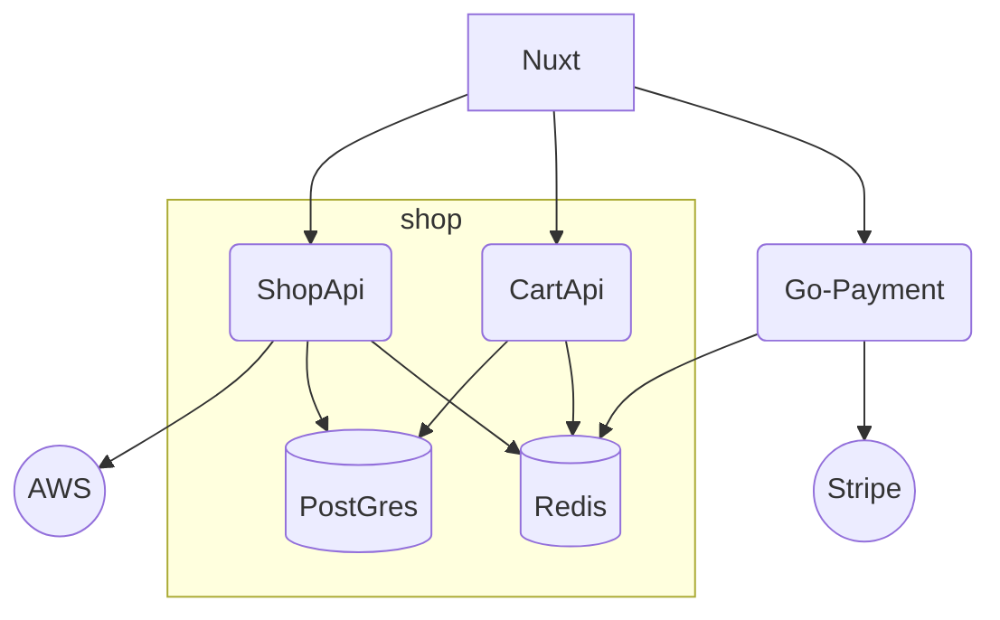
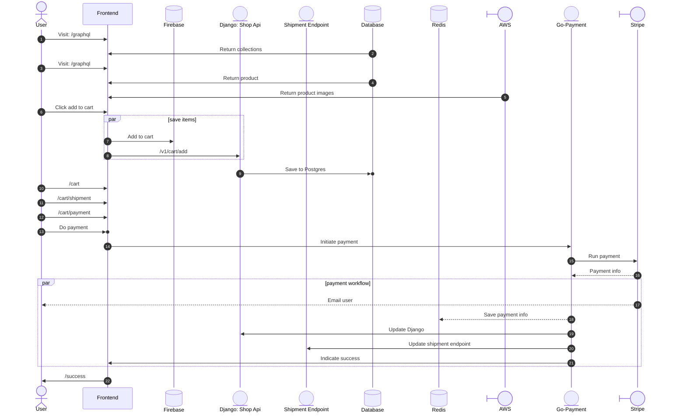
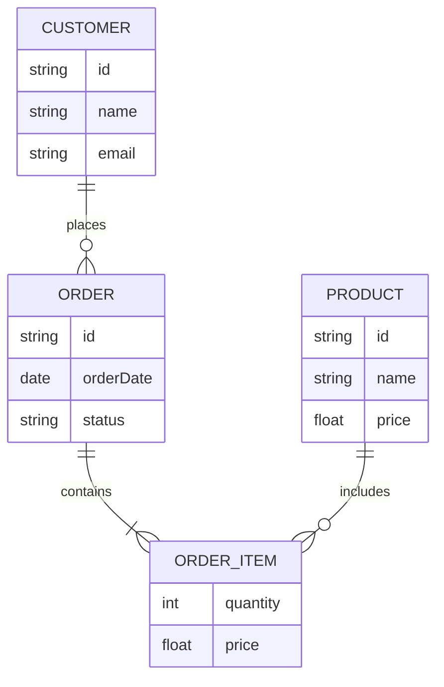
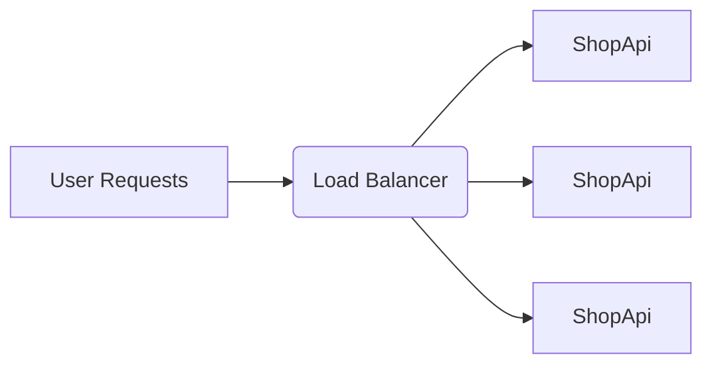

# Fullstack Ecommerce Platform Architecture

## Requirements & Assumptions 🟠

### Clarifying Questions

*Questions that need to be answered to better understand the requirements and constraints of the system*

- **Channels** Email ? SMS ? Push Notifications ?
- **User Authentication** Email/Password ? Social Login ?
- **Payment Methods** Credit Card ? Klarna ? Stripe ? Other ?
- **Shipping Methods** Standard ? Express ? International ?
- **Inventory Management** How is inventory tracked and updated? Local with Django Api or external inventory service?
- **Order Management** How are orders processed and tracked? Local with Django Api or external order management service?
- **Cart Management** How are shopping carts managed? Firebase? Firebase + Django Postgres? Django Postgres?
- **Product Management** Internal with Django (Shop Api) or external product management service?
- **Reviews and Ratings** Stored locally with Django Postgres or external review service?

### Functional Requirements 🟢

*Describes the specific features and functionalities that the system must provide*

- **Admin** Dashboard for managing products, orders, inventory, and users.
- **Products** Allow users to browse, search, and view product details.
- **Cart** Allow users to add, remove, and update items in their shopping cart.
- **Orders** Allow users to place orders and view order history.
- **Payments** Support multiple payment methods for completing purchases.
- **Shipping** Provide options for different shipping methods and track shipping status.
- **Reviews and Ratings** Allow users to submit and view reviews and ratings for products.
- **Wishlist** Allow users to add, remove, and view items in their wishlist.

## Capacity Planning ⏰

### Database

*Estimates the expected load on the system, such as the number of users, transactions, or requests per second. This helps in designing a system that can handle the anticipated traffic and scale as needed*

Estimation for a 100 products scenario:

- **Products** 100 products in the catalog
- **Users** 1000 users in the system
- **Reviews** 200 reviews per month
- **Wishlist Items** 300 wishlist items per month
- **Pages visited** 2 pages per visitor per session. 2000 pages per month (1000 users * 2 pages).
- **RPR (Repeat Purchase Rate)** 25% over a 12 month period. Repeat buyers: 250 (25% of 1000 users). One time purchases: 750 (1000 - 250).
- **Total orders** 500 (250 repeat buyers + 750 one time purchases * 1 order each).
- **Database Queries** Assuming each user session requires 6 database queries [home page collections + collection details + product details + add to cart + view cart + checkout], the system would need to handle approximately 0.00095 queries per second (500 orders per month / 31 536 000 seconds in a year).

### Storage

*Estimates the storage requirements for the system, such as the amount of data that needs to be stored and the growth rate over time. This helps in designing a system that can handle the anticipated storage needs and scale as required.*

Estimation for a 100 products scenario:

- **Product Images** Assuming each product has 5 images of 500KB each, total storage for product images: 100 products * 5 images * 500KB = 250MB.
- **User Data** Assuming each user has 1MB of data, total storage for user data: 1000 users * 1MB = 1GB.
- **Reviews** Assuming each review is 1KB, total storage for reviews: 200 reviews per month * 12 months * 1KB = 2.4MB per year.
- **Wishlist Items** Assuming each wishlist item is 1KB, total storage for wishlist items: 300 wishlist items per month * 12 months * 1KB = 3.6MB per year.
- **Orders** Assuming each order is 10KB, total storage for orders: 500 orders per month * 12 months * 10KB = 60MB per year.
- **Database Storage** Total estimated storage: 250MB (product images) + 1GB (user data) + 2.4MB (reviews) + 3.6MB (wishlist items) + 60MB (orders) ≈ 1.315GB per year.

## High Level Architecture 🏗️

*Describes the overall structure of the system, including the main components and how they interact with each other. This can be illustrated using diagrams such as component diagrams or architecture diagrams.*

## System Workflow 🔄

*Explains the sequence of interactions between different components of the system, such as how a user request flows through the application, how data is processed, and how responses are generated. This can be illustrated using sequence diagrams or flowcharts.*

* Emailing service architecture: [services/goemailer/ARCHITECTURE.md](services/goemailer/ARCHITECTURE.md)

## Api Design 🛠️

*Describes the design of the APIs that will be used for communication between different components of the system, such as the frontend and backend. This includes the endpoints, request and response formats, authentication mechanisms, and any other relevant details about how the APIs will function.*

> Determines also whether the system will be using RESTful APIs or GraphQL, and how the frontend will interact with these APIs to fetch and manipulate data.
> If the system uses microservices architecture, the API design will also include details about how different microservices will communicate with each other, such as using RESTful APIs, gRPC, or message queues.

| Endpoint          | Method | Description                            | Request Body                                                          | Response Body                             |
| ----------------- | ------ | -------------------------------------- | --------------------------------------------------------------------- | ----------------------------------------- |
| /graphql          | POST   | Retrieve a list of products            | { query: string, variables: object }                                  | List of products with details             |
| /graphql          | POST   | Retrieve details of a specific product | { query: string, variables: object }                                  | Product details                           |
| /graphql          | POST   | Add a product to the shopping cart     | { query: string, variables: object }                                  | Updated shopping cart details             |
| /graphql          | POST   | Process the checkout and payment       | { query: string, variables: object }                                  | Order confirmation and details            |
| /graphql          | POST   | Retrieve a list of user orders         | { query: string, variables: object }                                  | List of user orders with details          |
| /graphql          | POST   | Retrieve details of a specific order   | { query: string, variables: object }                                  | Order details                             |
| /api/v1/signup    | POST   | Register a new user                    | { username: string, password: string, password_confirmation: string } | User registration confirmation            |
| /auth/v1/token/   | POST   | Authenticate a user                    | { username: string, password: string }                                | Authentication token and user details     |
| /v1/auth/refresh  | POST   | Refresh authentication token           | { refresh_token: string }                                             | New authentication token and user details |
| /v1/token/verify/ | POST   | Verify authentication token            | { token: string }                                                     | Verification result                       |

## Data storage

*Describes how the system will store and manage data, including the choice of database (e.g., relational, NoSQL), data models, and how data will be accessed and manipulated by the application.*

**Cart Storage**: The elements and details of the shopping cart are saved in Firebase Realtime Database, allowing for real-time synchronization of cart data across multiple devices and sessions.
**Product Storage**: Product details and metadata are stored in a relational database (PostgreSQL), while product images and other media files are stored in Amazon S3 for efficient retrieval and scalability.
**Session Storage**: User session data is stored in Firebase Realtime Database.
**Order Storage**: Order details and history are stored in a relational database (PostgreSQL) to ensure data integrity and support complex queries related to order management and in Redis for caching frequently accessed order data.

### Amazon S3

*Explains the the manner in which the system will use Amazon S3 for storing and retrieving files, including the structure of the S3 buckets, access control policies, and how the application will interact with S3 for file uploads and downloads.*

### Database

*Explains the choice of database (e.g., relational, NoSQL) and how it will be used to store and manage data for the application. This includes the data models, relationships between entities, and how the application will perform CRUD (Create, Read, Update, Delete) operations on the database.*

## Caching

*Describes the caching strategy for the application, including what data will be cached, how it will be cached (e.g., in-memory cache, distributed cache), and how the cache will be invalidated when data changes. For example, product data that is frequently accessed but infrequently updated can be cached to improve performance and reduce load on the database.*

Caching will be almost exlusively done with Redis as an in-memory data store.

## Scalability

*Describes how the system will be designed to handle increasing loads and scale as needed. This includes strategies for horizontal scaling (adding more servers) and vertical scaling (upgrading existing servers), as well as any load balancing techniques that will be used to distribute traffic across multiple servers.*

---

## References ⏰

*List of services and components that will be part of the system, along with their respective technologies and descriptions. This can be presented in a tabular format for clarity.*

| Service   | Language/Framework | Description                                    |
| --------- | ------------------ | ---------------------------------------------- |
| ShopApi   | Django             | Manages product catalog and related operations |
| CartApi   | Django             | Manages shopping cart operations               |
| GoPayment | Django             | Handles payment processing                     |
| Frontend  | Nuxt 4             | Renders the desktop user interface             |

## Technologies Used 🌳

*List of the main technologies used in the system, along with their purpose and version. This can help in understanding the technical stack of the application and how different components are implemented.*

| Technology        | Purpose/Usage            | Version |
| ----------------- | ------------------------ | ------- |
| Django            | Web framework            | ✅ 6.X  |
| PostgreSQL        | Database                 | ✅ 13.X |
| Redis             | Caching, message broker  | ✅ -    |
| RabbitMQ          | Message broker           | ✅ -    |
| Docker            | Containerization         | ✅ 20.X |
| Nuxt 4            | Frontend framework       | ✅ 4.X  |
| Firebase          | Authentication, database | ✅ -    |
| AWS S3            | Static and media storage | ✅ -    |
| Cloudfront        | CDN for static files     | ✅ -    |
| Google Analytics  | Traffic analysis         | ✅ -    |
| Facebook Pixels   | Traffic analysis         | ✅ -    |
| Microsoft Clarity | Traffic analysis         | ✅ -    |
